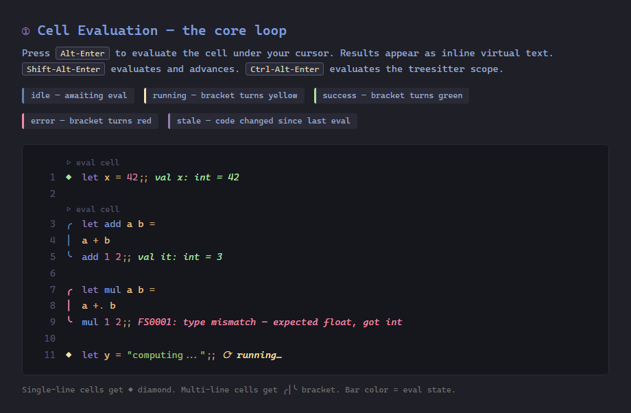
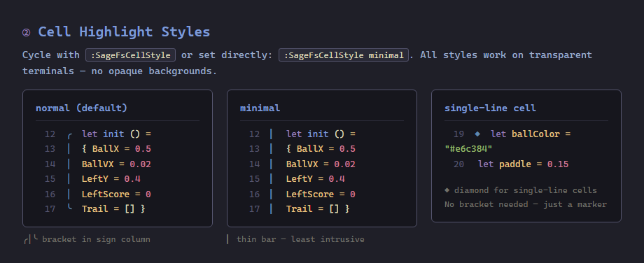
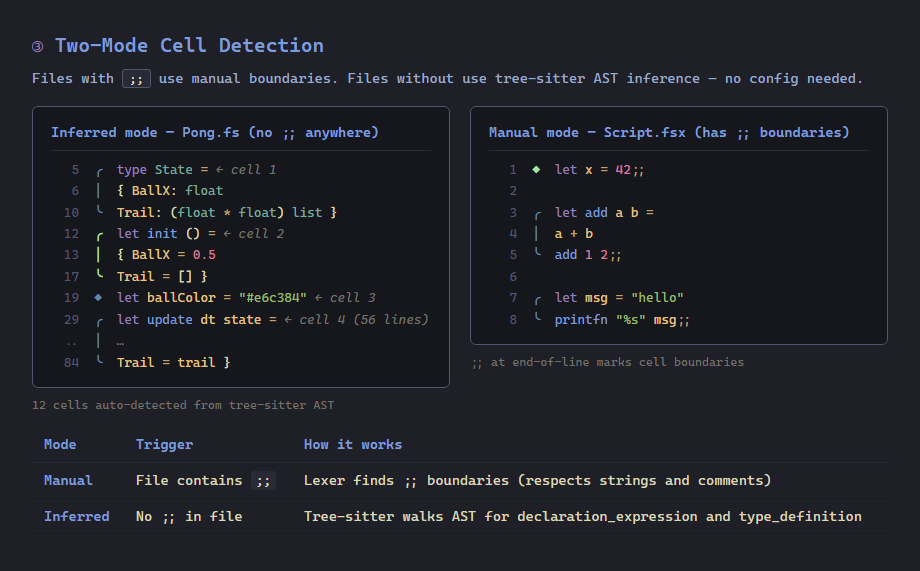
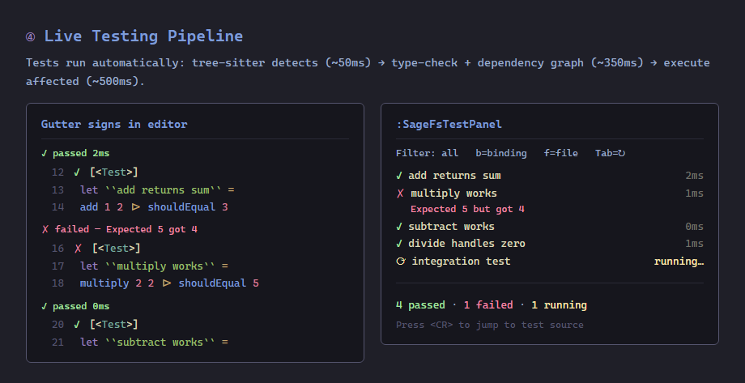
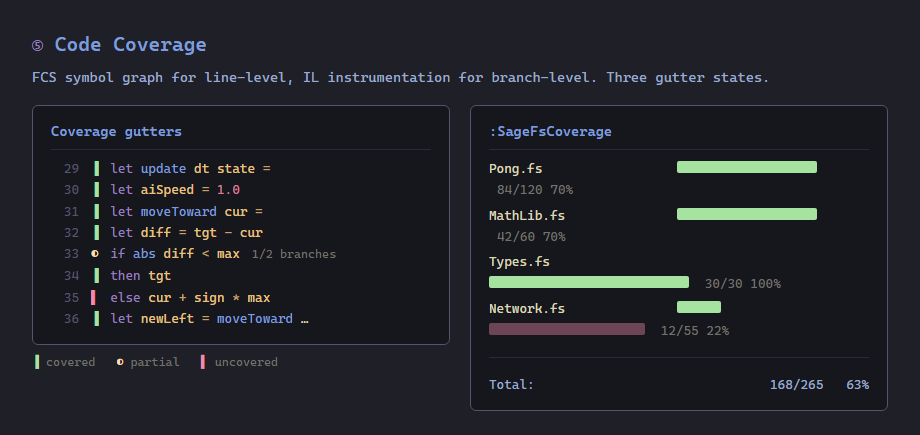
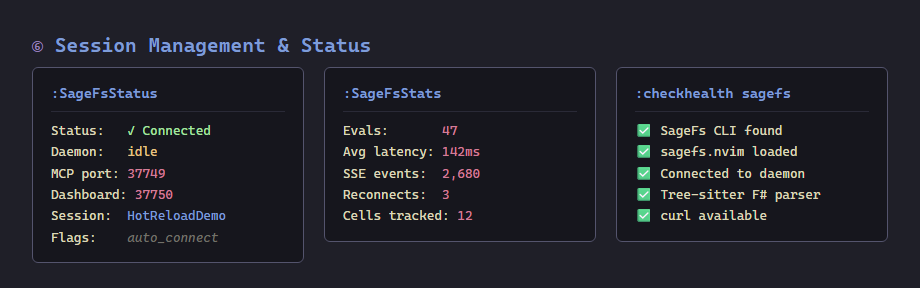
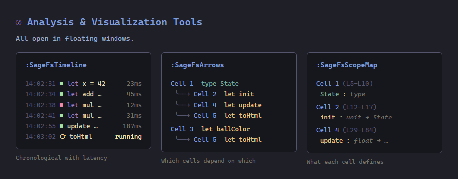
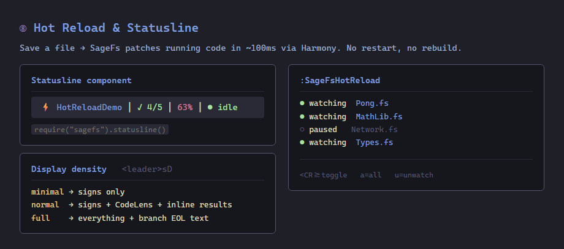
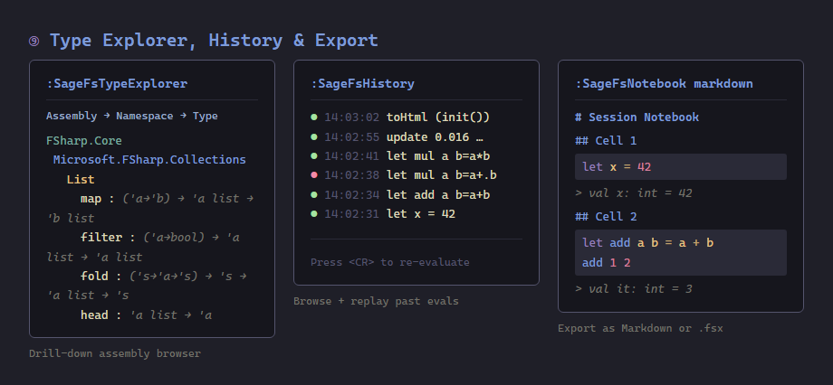

# sagefs.nvim

Neovim frontend for [SageFs](https://github.com/WillEhrendreich/SageFs) — a live F# development server that eliminates the edit-build-run cycle. SageFs provides sub-second hot reload, live unit testing with a three-speed pipeline, FCS-based code coverage, an affordance-driven MCP server for AI agents, multi-session management, file watching, and more. This plugin connects Neovim to the running daemon, giving you cell evaluation with inline results, session management, hot reload controls, live test state, coverage gutter signs, and SSE live updates from your editor.

## Feature Tour



















## What is SageFs?

SageFs is a [.NET global tool](https://learn.microsoft.com/en-us/dotnet/core/tools/global-tools) that turns F# Interactive into a full development environment. Start the daemon once (`sagefs --proj YourApp.fsproj`), then connect from VS Code, Neovim, the terminal, a GPU-rendered GUI, a web dashboard, or all of them at once — they all share the same live session state.

**Key SageFs capabilities:**

- **Sub-second hot reload** — Save a `.fs` file and your running web server picks up the change in ~100ms. [Harmony](https://github.com/pardeike/Harmony) patches method pointers at runtime — no restart, no rebuild. Browsers auto-refresh via SSE.
- **Live unit testing** — A three-speed pipeline: tree-sitter detects tests in ~50ms (even in broken code), F# Compiler Service type-checks and builds a dependency graph in ~350ms, then affected tests execute in ~500ms total. Gutter markers show pass/fail inline. Covers xUnit, NUnit, MSTest, TUnit, and Expecto via a two-tier provider system. Configurable run policies per test category (unit tests on every keystroke, integration on save, browser on demand). Free — no VS Enterprise license needed.
- **FCS-based coverage + IL branch coverage** — Line-level code coverage computed from F# Compiler Service typed AST symbol graph (lightweight, no IL instrumentation for basic coverage), plus IL-instrumented branch-level coverage showing which branches within a line are hit. Both streamed as SSE events with per-file and per-line annotations.
- **Full project context in the REPL** — All NuGet packages, project references, and namespaces loaded automatically. No `#r` directives.
- **Affordance-driven MCP** — AI tools (Copilot, Claude, etc.) can execute F# code, type-check, explore .NET APIs, run tests, and manage sessions against your real project via [Model Context Protocol](https://modelcontextprotocol.io/). The MCP server only presents tools valid for the current session state — agents see `get_fsi_status` during warmup, then `send_fsharp_code` once ready. No wasted tokens from guessing.
- **Multi-session isolation** — Run multiple FSI sessions simultaneously across different projects, each in an isolated worker sub-process. A standby pool of pre-warmed sessions makes hard resets near-instant.
- **Crash-proof supervisor** — Erlang-style auto-restart with exponential backoff (`sagefs --supervised`). Watchdog state exposed via API and shown in editor status bars.
- **Event sourcing** — All session events (evals, resets, diagnostics, errors) stored in PostgreSQL via [Marten](https://martendb.io/) for history replay and analytics.

See the [SageFs README](https://github.com/WillEhrendreich/SageFs) for full details, including CLI reference, per-directory config (`.SageFs/config.fsx`), startup profiles, and the full [frontend feature matrix](https://github.com/WillEhrendreich/SageFs#frontend-feature-matrix).

## Plugin Status

This plugin provides the Neovim integration layer. **37 Lua modules, 1161 tests, zero failures.**

### Fully Implemented & Tested

| Feature | Description |
|---------|-------------|
| **Cell evaluation** | `;;` boundaries define cells. `<Alt-Enter>` evaluates the cell under cursor. |
| **Eval and advance** | `<Shift-Alt-Enter>` evaluates and jumps to the next cell. |
| **Visual selection eval** | Select code in visual mode, `<Alt-Enter>` to evaluate. |
| **File evaluation** | Evaluate the entire buffer with `:SageFsEvalFile`. |
| **Cancel evaluation** | `:SageFsCancel` stops a running evaluation. |
| **Inline results** | Success/error output as virtual text at the `;;` boundary. |
| **Virtual lines** | Multi-line output rendered below the `;;` boundary. |
| **Gutter signs** | Check/X/spinner indicators for cell state (success/error/running). |
| **CodeLens-style markers** | Eval virtual text above idle/stale cells. |
| **Stale detection** | Editing a cell marks its result as stale automatically. |
| **Flash animation** | Brief highlight flash when a cell begins evaluation. |
| **Session management** | Create, switch, stop sessions via picker (`:SageFsSessions`). |
| **Project discovery** | Auto-discovers `.fsproj` files and offers to create sessions. |
| **Smart eval** | If no session exists, prompts to create one before evaluating. |
| **Session context** | Floating window showing assemblies, namespaces, warmup details. |
| **Hot reload controls** | Per-file toggle, watch-all, unwatch-all via picker. |
| **SSE dispatch pipeline** | All SageFs event types classified and routed through pcall-protected dispatch. |
| **SSE live updates** | Subscribes to SageFs event stream with exponential backoff reconnect (1s→32s). |
| **State recovery** | Full state synced on SSE reconnect — no stale data after drops. |
| **Live diagnostics** | F# errors/warnings streamed via SSE into `vim.diagnostic`. |
| **Check on save** | `BufWritePost` sends `.fsx` file content for type-checking (LSP already covers `.fs`). Diagnostics arrive via SSE. Behind `check_on_save` config flag. |
| **Live test gutter signs** | Pass/fail/running/stale signs per test in the sign column. |
| **Live test panel** | `:SageFsTestPanel` → persistent split with test results, `<CR>` to jump to source. |
| **Tests for current file** | `:SageFsTestsHere` → floating window with tests for the file you're editing. |
| **Run tests** | `:SageFsRunTests [pattern]` → trigger test execution with optional filter. |
| **Test policy controls** | `:SageFsTestPolicy` → drill-down `vim.ui.select` for category+policy. |
| **Enable/disable live testing** | `:SageFsEnableTesting` / `:SageFsDisableTesting` → explicit live test pipeline control. |
| **Test trace** | `:SageFsTestTrace` → floating window showing the three-speed pipeline state. |
| **Coverage gutter signs** | Green=covered, Red=uncovered per-line signs from FCS symbol graph. |
| **Coverage panel** | `:SageFsCoverage` → floating window with per-file breakdown + total. |
| **Coverage statusline** | Coverage percentage in combined statusline component. |
| **Type explorer** | `:SageFsTypeExplorer` → completions-based namespace/type drill-down. |
| **History browser** | `:SageFsHistory` → eval history for the cell under cursor with snapshot preview. |
| **Export to .fsx** | `:SageFsExport` → export session history as executable F# script. |
| **Load script** | `:SageFsLoadScript` → load an `.fsx` file via `#load`. File completion support. |
| **Call graph** | `:SageFsCallers`/`:SageFsCallees` → floating window with call graph. |
| **Daemon lifecycle** | `:SageFsStart`/`:SageFsStop` → start/stop the SageFs daemon from Neovim. |
| **Status dashboard** | `:SageFsStatus` → floating window with daemon, session, tests, coverage, config. |
| **User autocmd events** | 28 event types fired via `User` autocmds for scripting integration. |
| **Combined statusline** | `require("sagefs").statusline()` → session │ testing │ coverage │ daemon. |
| **Code completion** | Omnifunc-based completions via SageFs completion endpoint. |
| **Session reset** | Soft reset and hard reset with rebuild. |
| **Treesitter cell detection** | Structural `;;` detection filtering boundaries in strings/comments. |
| **SSE session scoping** | Events tagged with `SessionId` — only your active session's data renders. Multi-session safe. |
| **Branch coverage gutters** | Three-state gutter signs from IL probe data: ▐ green (full), ◐ yellow (partial), ▌ red (uncovered). Color-blind accessible (shape+color pairing). |
| **Branch EOL text** | Optional `n/m` branches annotation at end of line for partial coverage. Behind density preset. |
| **Filterable test panel** | Test panel filters by scope: `b` = binding (treesitter), `f` = current file, `m` = module, `a` = all, `Tab` = cycle. Failures sorted first. |
| **Display density presets** | `<leader>rD` cycles minimal (signs only) → normal (signs+codelens+inline) → full (everything+branch EOL). |
| **Cell highlight styles** | `╭│╰` bracket in sign column (normal), `▎` bar (minimal), line highlight (full). No opaque backgrounds on transparent terminals. |
| **Treesitter scope inference** | Files without `;;` use treesitter to find the top-level declaration under cursor. Two-mode: explicit (`;;`) or inferred (cursor context). |
| **Runtime statistics** | `:SageFsStats` → eval count, average latency, SSE events, reconnects, cells tracked. |
| **Eval timeline** | `:SageFsTimeline` → flame-chart visualization of eval history with latency breakdown. |
| **Diff viewer** | `:SageFsDiff` → side-by-side diff of last two evaluations of the current cell. |
| **Dependency arrows** | `:SageFsArrows` → cross-cell dependency visualization in floating window. |
| **Scope map** | `:SageFsScopeMap` → binding scope map showing what's defined in each cell. |
| **Type flow** | `:SageFsTypeFlow` → cross-cell type flow visualization showing how types propagate. |
| **Notebook export** | `:SageFsNotebook [markdown\|fsx]` → export session as literate notebook. |
| **Playground** | `:SageFsPlayground` → open scratch F# buffer for quick experiments. |
| **Health module** | `:checkhealth sagefs` validates CLI, plugin, daemon, treesitter, curl. |

## Requirements

- [SageFs](https://github.com/WillEhrendreich/SageFs) running (`sagefs --proj YourApp.fsproj`)
- Neovim 0.10+
- `curl` on PATH

## Installation

### lazy.nvim

```lua
{
  "WillEhrendreich/sagefs.nvim",
  ft = { "fsharp" },
  opts = {
    port = 37749,           -- MCP server port
    dashboard_port = 37750, -- Dashboard/hot-reload port
    auto_connect = true,    -- Connect SSE on startup
    check_on_save = false,  -- Type-check .fsx files on save (diagnostics via SSE)
  },
}
```

### Local development

```lua
{
  "WillEhrendreich/sagefs.nvim",
  dev = true,
  dir = "C:/Code/Repos/sagefs.nvim",
  ft = { "fsharp" },
  opts = {
    port = 37749,
    dashboard_port = 37750,
    auto_connect = true,
  },
}
```

## Keymaps

All keymaps use the `<leader>r` prefix (**R**EPL) to avoid conflicts with LazyVim's `<leader>s` (Search) namespace.

| Key | Mode | Description |
|-----|------|-------------|
| **Core eval** | | |
| `<Alt-Enter>` | n | Evaluate cell under cursor (with smart session check) |
| `<Shift-Alt-Enter>` | n | Evaluate cell and advance to next cell |
| `<Alt-Enter>` | v | Evaluate selection |
| `<leader>re` | n | Evaluate cell |
| `<leader>rl` | n | Evaluate current line |
| `<leader>rf` | n | Evaluate file |
| `<leader>rc` | n | Clear all results |
| `<leader>rx` | n | Cancel eval |
| **Sessions & connection** | | |
| `<leader>rs` | n | Session picker |
| `<leader>rC` | n | Connect SSE stream |
| `<leader>rX` | n | Disconnect SSE stream |
| `<leader>ri` | n | Status info |
| **Testing** | | |
| `<leader>rt` | n | Test panel |
| `<leader>rT` | n | Run tests |
| `<leader>rth` | n | Tests here (current file) |
| `<leader>rtf` | n | Test failures |
| `<leader>rtp` | n | Test trace |
| `<leader>rte` | n | Enable live testing |
| `<leader>rtd` | n | Disable live testing |
| **Browse & explore** | | |
| `<leader>rb` | n | Bindings |
| `<leader>rd` | n | Eval diff |
| `<leader>rg` | n | Scope map |
| `<leader>rm` | n | Timeline |
| `<leader>ry` | n | Type explorer |
| `<leader>ra` | n | Callers |
| `<leader>ro` | n | Callees |
| `<leader>rv` | n | Coverage |
| **Server & reload** | | |
| `<leader>rh` | n | Hot reload file picker |
| `<leader>rr` | n | Soft reset |
| `<leader>rR` | n | Hard reset |
| `<leader>rS` | n | Start server |
| `<leader>rQ` | n | Stop server |
| `<leader>rD` | n | Cycle display density (minimal/normal/full) |
| **Misc** | | |
| `<leader>rp` | n | Playground |
| `<leader>rn` | n | Notebook export |
| `<leader>rw` | n | Watch all files |
| `<leader>rW` | n | Unwatch all files |

## Commands

| Command | Description |
|---------|-------------|
| `:SageFsEval` | Evaluate current cell |
| `:SageFsEvalAdvance` | Evaluate current cell and advance to next |
| `:SageFsEvalFile` | Evaluate entire file |
| `:SageFsCancel` | Cancel a running evaluation |
| `:SageFsClear` | Clear all extmarks |
| `:SageFsConnect` | Connect SSE stream |
| `:SageFsDisconnect` | Disconnect SSE stream |
| `:SageFsStatus` | Status dashboard (daemon, session, tests, coverage, config) |
| `:SageFsSessions` | Session picker (create/switch/stop/reset) |
| `:SageFsCreateSession` | Discover projects and create session |
| `:SageFsStart` | Start SageFs daemon from Neovim |
| `:SageFsStop` | Stop the managed SageFs daemon |
| `:SageFsHotReload` | Hot reload file picker |
| `:SageFsWatchAll` | Watch all project files for hot reload |
| `:SageFsUnwatchAll` | Unwatch all files |
| `:SageFsReset` | Soft reset active FSI session |
| `:SageFsHardReset` | Hard reset (rebuild) active FSI session |
| `:SageFsContext` | Show session context (assemblies, namespaces, warmup) |
| `:SageFsLoadScript` | Load an `.fsx` file via `#load` (file completion) |
| `:SageFsTests` | Show live test results panel (floating) |
| `:SageFsTestPanel` | Toggle persistent test results split |
| `:SageFsTestsHere` | Show tests for the current file |
| `:SageFsFailures` | Jump to failing tests (Telescope integration) |
| `:SageFsRunTests [pattern]` | Run tests (optional name filter) |
| `:SageFsTestPolicy` | Configure test run policies per category |
| `:SageFsEnableTesting` | Enable live testing |
| `:SageFsDisableTesting` | Disable live testing |
| `:SageFsTestTrace` | Show the three-speed test pipeline state |
| `:SageFsCoverage` | Show coverage summary with per-file breakdown |
| `:SageFsTypeExplorer` | Browse namespaces → types → members via completions |
| `:SageFsHistory` | Eval history for cell under cursor |
| `:SageFsExport` | Export session history as `.fsx` file |
| `:SageFsCallers <symbol>` | Show callers of a symbol |
| `:SageFsCallees <symbol>` | Show callees of a symbol |
| `:SageFsStats` | Runtime statistics (eval count, latency, SSE events) |
| `:SageFsTimeline` | Eval timeline flame chart |
| `:SageFsDiff` | Diff between last two evals of current cell |
| `:SageFsArrows` | Cross-cell dependency arrows |
| `:SageFsScopeMap` | Binding scope map for all evaluated cells |
| `:SageFsTypeFlow` | Cross-cell type propagation flow |
| `:SageFsNotebook [format]` | Export session as literate notebook (markdown or fsx) |
| `:SageFsPlayground` | Open F# scratch buffer for experiments |
| `:SageFsExportFile` | Export session history as .fsx file to disk |
| `:SageFsCellStyle [style]` | Set or cycle cell highlight style (off/minimal/normal/full) |
| `:SageFsBindings` | Show FSI binding state |
| `:SageFsEvalLine` | Evaluate current line only |

## Architecture

Pure Lua modules (tested with [busted](https://lunarmodules.github.io/busted/) outside Neovim) + a thin integration layer:

| Module | Lines | Purpose |
|--------|-------|---------|
| `cells.lua` | ~270 | `;;` boundary detection, cell finding, treesitter boundary support |
| `format.lua` | ~390 | Result formatting, status report builder, `build_render_options` |
| `model.lua` | ~205 | Elmish state machine with validated transitions (idle→running→success/error→stale) |
| `sse.lua` | ~165 | SSE parser, event classification, dispatch table, pcall batch dispatch |
| `sessions.lua` | ~100 | Session response parsing, context-sensitive action filtering |
| `diagnostics.lua` | ~90 | Diagnostic grouping, vim.diagnostic conversion, check response parsing |
| `testing.lua` | ~1200 | Live testing state — SSE handlers, gutter signs, panel formatting, policies, pipeline, annotations |
| `coverage.lua` | ~110 | Line-level coverage state, file/total summaries, gutter signs, statusline |
| `type_explorer.lua` | ~100 | Assembly/namespace/type/member formatting for pickers and floats |
| `type_explorer_cache.lua` | ~65 | In-memory cache for type explorer data, invalidated on hard reset |
| `history.lua` | ~60 | FSI event history formatting for picker and preview |
| `export.lua` | ~20 | Session export to .fsx format |
| `events.lua` | ~80 | User autocmd event definitions (28 event types) |
| `completions.lua` | ~25 | Omnifunc completion parsing and formatting |
| `util.lua` | ~50 | Shared utilities (json_decode) |
| `hotreload_model.lua` | ~55 | Pure hot reload URL builder, state, picker formatting |
| `daemon.lua` | ~70 | Daemon lifecycle state machine (idle→starting→running→stopped) |
| `test_trace.lua` | ~65 | Test trace parsing and formatting |
| `annotations.lua` | ~240 | Coverage annotation formatting, branch coverage signs, CodeLens, inline failures |
| `density.lua` | ~55 | Display density presets (minimal/normal/full), layer visibility control |
| `cell_highlight.lua` | ~265 | Dynamic eval region visuals — `╭│╰` bracket, 4 styles, eval-state color hints |
| `diff.lua` | ~75 | Semantic diff between cell evaluation results |
| `depgraph.lua` | ~95 | Cross-cell dependency graph with reactive staleness tracking |
| `depgraph_viz.lua` | ~125 | ASCII arrow rendering for dependency visualization |
| `timeline.lua` | ~90 | Eval timeline recording and flame-chart formatting |
| `time_travel.lua` | ~105 | Cell history recording with snapshot management |
| `scope_map.lua` | ~75 | Binding scope map — tracks what each cell defines |
| `notebook.lua` | ~105 | Literate notebook export (markdown + fsx formats) |
| `type_flow.lua` | ~105 | Cross-cell type propagation analysis and visualization |
| `health.lua` | ~70 | Health check module for `:checkhealth sagefs` |
| `treesitter_cells.lua` | ~195 | Tree-sitter based cell detection for F# (inferred mode) |
| `version.lua` | 1 | Plugin version string |
| **Integration layer** | | |
| `init.lua` | ~970 | Coordinator: SSE dispatch, eval, session API, check-on-save, daemon |
| `transport.lua` | ~215 | HTTP via curl, SSE connections with exponential backoff reconnect |
| `render.lua` | ~380 | Extmarks, test/coverage gutter signs, floating windows |
| `commands.lua` | ~1420 | All 47 commands, keymaps, autocmds |
| `hotreload.lua` | ~110 | Hot reload file toggle API |

All pure modules have zero vim API dependencies — they are testable under busted without a running Neovim instance.

### How it communicates with SageFs

- **POST `/exec`** — Send F# code for evaluation (via curl jobstart)
- **POST `/diagnostics`** — Fire-and-forget type-check (results arrive via SSE)
- **GET `/events`** — SSE stream for live updates (connection state, test results, coverage, etc.)
- **GET `/health`** — Health check with session status
- **`/api/status`** — Rich JSON status (session state, eval stats, projects, pipeline)
- **`/api/sessions/*`** — Session management (list, create, switch, stop)
- **`/api/sessions/{id}/hotreload/*`** — Hot reload file management
- **`/api/sessions/{id}/warmup-context`** — Session context (assemblies, namespaces)
- **POST `/dashboard/completions`** — Code completions at cursor position
- **POST `/reset`**, **POST `/hard-reset`** — Session reset endpoints
- **POST `/api/live-testing/enable`** — Enable live testing
- **POST `/api/live-testing/disable`** — Disable live testing
- **POST `/api/live-testing/policy`** — Set run policy per test category
- **POST `/api/live-testing/run`** — Trigger test execution with optional filters

## Running Tests

```cmd
test.cmd                        # Run full suite (busted + integration)
test_e2e.cmd                    # Run E2E tests against a real SageFs daemon
busted spec/cells_spec.lua      # Run a single busted spec
busted --filter "find_cell"     # Filter by test name
nvim --headless --clean -u NONE -l spec/nvim_harness.lua  # Integration only
```

### Test architecture

| Suite | Runner | Count | What it covers |
|-------|--------|-------|----------------|
| **Busted (pure)** | `busted` via LuaRocks | 1107 | Pure module logic — cells, format, model, SSE dispatch, sessions, testing, diagnostics, coverage, type explorer, type explorer cache, history, export, events, hotreload model, daemon, pipeline, completions, cell highlight, diff, depgraph, timeline, time_travel, scope_map, notebook, type_flow, health. State machine validation, property tests, snapshot tests, composition, idempotency. |
| **Integration** | Headless Neovim (`nvim -l`) | 54 | Real vim APIs — plugin setup, 47 command registration, extmark rendering, highlight groups, keymaps, autocmds, cell lifecycle, SSE→model→extmark pipeline, multi-buffer isolation, test gutter signs, coverage gutter signs, combined statusline. |
| **E2E** | Headless Neovim + real SageFs | 27 | Full daemon lifecycle — eval (health, simple/error/module/multi-line), SSE event streaming, session management (list/metadata/reset), live testing (toggle/run/policy/SSE events), hot reload (module types, file modification, daemon resilience), code completions (System.String, List, project module). |
| **Total** | | **1188** | 1161 unit+integration (all passing), 27 E2E (requires running SageFs) |

The E2E suite uses 4 sample projects (`samples/Minimal`, `samples/WithTests`, `samples/MultiFile`, `samples/HotReloadDemo`). Each E2E spec copies a sample to a temp directory, starts a SageFs daemon, runs tests, then cleans up.

Requires [busted](https://lunarmodules.github.io/busted/) and `dkjson` via LuaRocks. Integration tests require Neovim 0.10+ on PATH. E2E tests additionally require `sagefs` and `dotnet` on PATH.

## SageFs MCP Tools Reference

These are the MCP tools exposed by SageFs. The server uses **affordance-driven tool exposure** — only tools valid for the current session state are presented. During warmup you see `get_fsi_status`; once ready, the full tool set appears.

| Tool | Description |
|------|-------------|
| `send_fsharp_code` | Execute F# code (each `;;` is a transaction — failures are isolated) |
| `check_fsharp_code` | Type-check without executing (pre-validate before committing) |
| `get_completions` | Code completions at cursor position |
| `cancel_eval` | Cancel a running evaluation (recover from infinite loops) |
| `load_fsharp_script` | Load an `.fsx` file with partial progress |
| `get_recent_fsi_events` | Recent evals, errors, and loads with timestamps |
| `get_fsi_status` | Session health, loaded projects, statistics, affordances |
| `get_startup_info` | Projects, features, CLI arguments |
| `get_available_projects` | Discover `.fsproj`/`.sln`/`.slnx` in working directory |
| `explore_namespace` | Browse types and functions in a .NET namespace |
| `explore_type` | Browse members and properties of a .NET type |
| `get_elm_state` | Current UI render state (editor, output, diagnostics) |
| `reset_fsi_session` | Soft reset — clear definitions, keep DLL locks |
| `hard_reset_fsi_session` | Full reset — rebuild, reload, fresh session |
| `create_session` | Create a new isolated FSI session |
| `list_sessions` | List all active sessions |
| `stop_session` | Stop a session by ID |
| `switch_session` | Switch active session by ID |
| `get_live_test_status` | Query live test state (with optional file filter) |
| `enable_live_testing` | Enable the live test pipeline |
| `disable_live_testing` | Disable the live test pipeline |
| `set_run_policy` | Control when test categories auto-run (every/save/demand/disabled) |
| `get_pipeline_trace` | Debug the three-speed test pipeline waterfall |
| `run_tests` | Run tests on demand with name/category filters |

## License

MIT