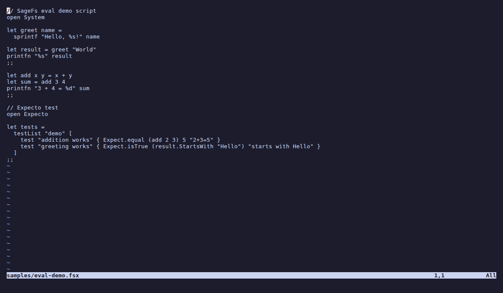
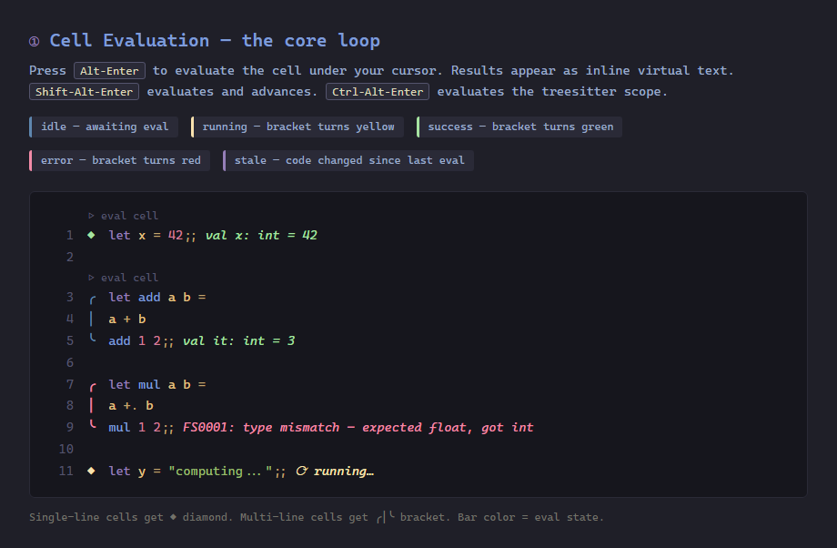
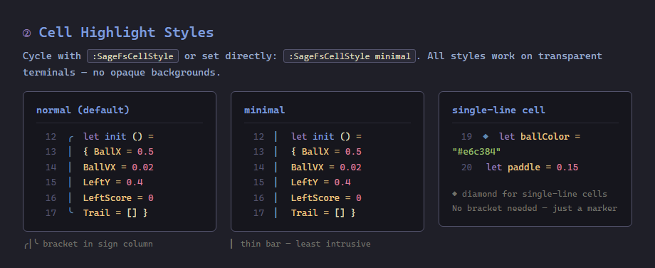
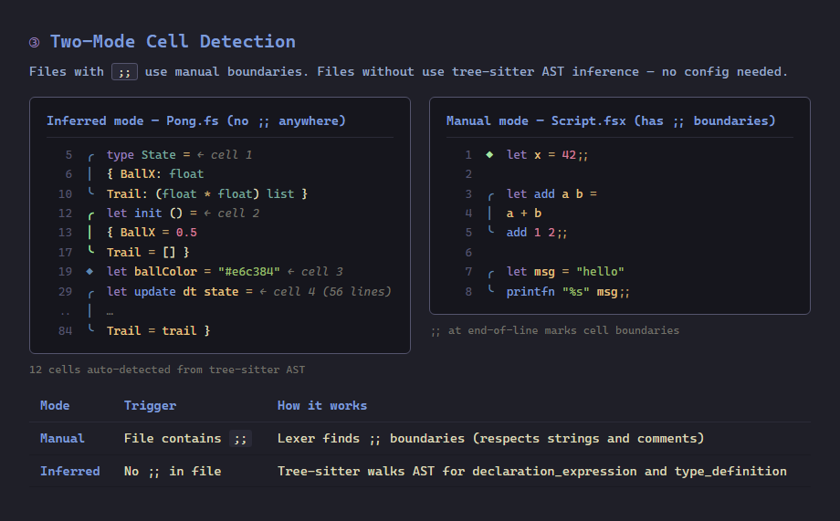
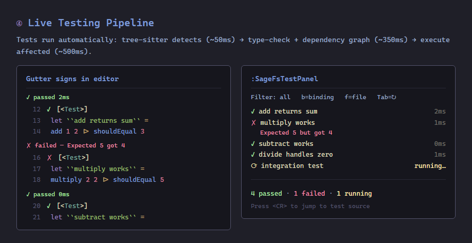
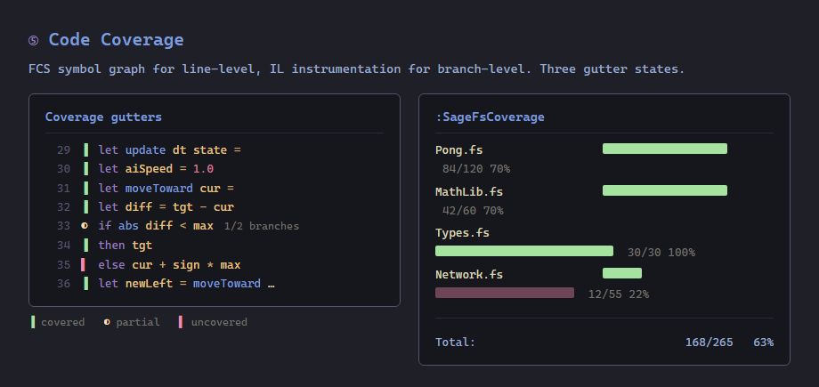
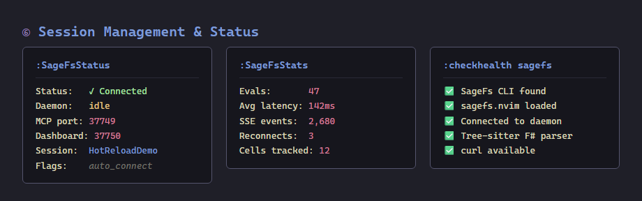
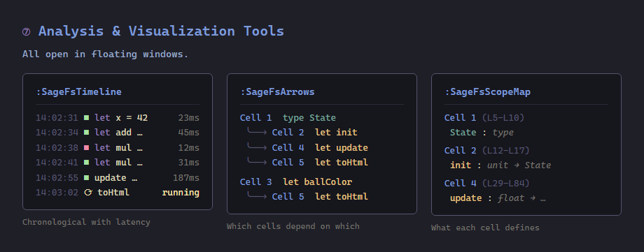
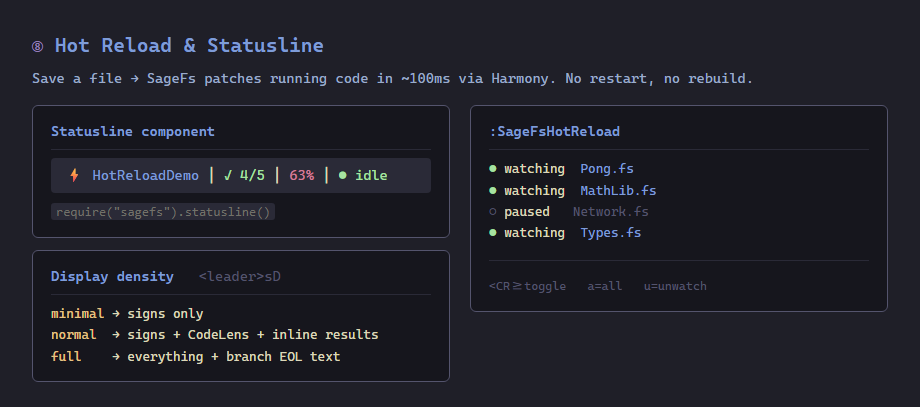
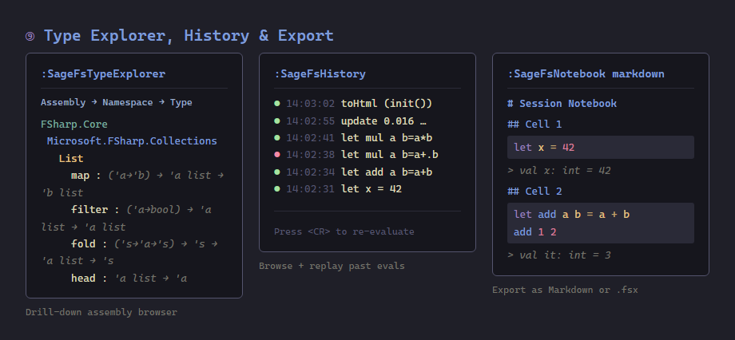

# sagefs.nvim

Neovim frontend for [SageFs](https://github.com/WillEhrendreich/SageFs) - a live F# development server that eliminates the edit-build-run cycle. SageFs provides sub-second hot reload, live unit testing with a three-speed pipeline, FCS-based code coverage, an affordance-driven MCP server for AI agents, multi-session management, file watching, and more. This plugin connects Neovim to the running daemon, giving you cell evaluation with inline results, session management, hot reload controls, live test state, coverage gutter signs, and SSE live updates from your editor.

## Screenshots & Demos

<table>
<tr>
<td align="center" width="50%">

**Eval Loop** - evaluate F# cells and see results inline as ghost text


</td>
<td align="center" width="50%">

**Live Testing** - tests run automatically as you type, results in the gutter



</td>
</tr>
<tr>
<td align="center" width="50%">

**Coverage** - line-level coverage with branch annotations in the gutter


</td>
<td align="center" width="50%">

**Cell Styles** - Full/Normal/Minimal density modes for different workflows


</td>
</tr>
</table>

## Feature Tour



















## What is SageFs?

SageFs is a [.NET global tool](https://learn.microsoft.com/en-us/dotnet/core/tools/global-tools) that turns F# Interactive into a full development environment. Start the daemon once (`sagefs --proj YourApp.fsproj`), then connect from VS Code, Neovim, the terminal, a GPU-rendered GUI, a web dashboard, or all of them at once - they all share the same live session state.

**Key SageFs capabilities:**

- **Sub-second hot reload** - Save a `.fs` file and your running web server picks up the change in ~100ms (design target; the engine README cites 300–800ms typical on the current FSI-driven hot path). [Harmony](https://github.com/pardeike/Harmony) patches method pointers at runtime - no restart, no rebuild ([`SageFs.Core/Middleware/HotReloading.fs`](https://github.com/WillEhrendreich/SageFs/blob/master/SageFs.Core/Middleware/HotReloading.fs#L375-L377)). Browsers auto-refresh via SSE/DevReload ([`SageFs.Host/DevReloadInjector.fs`](https://github.com/WillEhrendreich/SageFs/blob/master/SageFs.Host/DevReloadInjector.fs)).
- **Live unit testing** - A three-speed pipeline (design-goal timings ~50ms detect / ~350ms analyze / ~500ms execute): [tree-sitter](https://github.com/WillEhrendreich/SageFs/blob/master/SageFs.Core/Features/TestTreeSitter.fs) detects tests even in broken code, F# Compiler Service type-checks and builds a dependency graph, then affected tests execute. Gutter markers show pass/fail inline. Covers xUnit, xUnit v3, NUnit, MSTest, TUnit, and Expecto via the executors in [`LiveTestingExecutors.fs`](https://github.com/WillEhrendreich/SageFs/blob/master/SageFs.Core/Features/LiveTestingExecutors.fs#L247-L302). Configurable run policies per test category. Free - no VS Enterprise license needed.
- **FCS-based coverage + IL branch coverage** - Line-level code coverage computed from F# Compiler Service typed AST symbol graph (lightweight, no IL instrumentation for basic coverage), plus IL-instrumented branch-level coverage ([`SageFs.Core/Features/CoverageInstrumenter.fs`](https://github.com/WillEhrendreich/SageFs/blob/master/SageFs.Core/Features/CoverageInstrumenter.fs)). Both streamed as SSE events with per-file and per-line annotations.
- **Full project context in the REPL** - All NuGet packages, project references, and namespaces loaded automatically. No `#r` directives.
- **Affordance-driven MCP** - AI tools (Copilot, Claude, etc.) can execute F# code, type-check, explore .NET APIs, run tests, and manage sessions against your real project via [Model Context Protocol](https://modelcontextprotocol.io/). The MCP server only presents tools valid for the current session state ([`SageFs.Core/Affordances.fs`](https://github.com/WillEhrendreich/SageFs/blob/master/SageFs.Core/Affordances.fs)) - agents see `get_fsi_status` during warmup, then `send_fsharp_code` once ready. No wasted tokens from guessing.
- **Multi-session isolation** - Run multiple FSI sessions simultaneously across different projects, each in an isolated worker sub-process. A standby pool of pre-warmed sessions makes hard resets near-instant.
- **Crash-proof supervisor** - Erlang-style auto-restart with exponential backoff (`sagefs --supervised`, implemented in [`SageFs/Program.fs`](https://github.com/WillEhrendreich/SageFs/blob/master/SageFs/Program.fs#L115-L116)). Watchdog state exposed via API and shown in editor status bars.
- **Binary session persistence** - Session state and test caches saved to compact binary files (`.sagefs` v3, `.sagetc` v1) for near-instant cold starts. Raw binary with CRC-32C integrity checking - no JSON parsing, no database ([`SageFs.Core/Features/TestCachePersistence.fs`](https://github.com/WillEhrendreich/SageFs/blob/master/SageFs.Core/Features/TestCachePersistence.fs)).

See the [SageFs README](https://github.com/WillEhrendreich/SageFs) for full details, including CLI reference, per-directory config (`.SageFs/config.fsx`), startup profiles, and the full [frontend feature matrix](https://github.com/WillEhrendreich/SageFs#frontend-feature-matrix).

## Plugin Status

This plugin provides the Neovim integration layer: a command for each thing it does, on top of a pure-Lua core that busted tests outside Neovim, plus a thin layer that a headless-Neovim harness tests. How to run both is under [Running Tests](#running-tests). I keep test and module counts out of this README because they go stale with every release; each runner prints its own summary line, and that is where the current numbers live.

### New in Latest

- **Telescope source-jump** - Press `<CR>` on any test in the telescope picker to jump directly to its source file and line
- **Failure narrative floating window** - Press `<C-d>` on a failing test to see a detailed floating window with:
  - **Summary**: What happened and why
  - **Time since last pass**: How long ago this test was green
  - **Causal changes**: Which symbols/files changed that likely caused the failure
- **test_source_locations SSE** - Daemon pushes test→file/line mappings for instant navigation
- **failure_narratives SSE** - Daemon pushes enriched failure context for each failing test

### Fully Implemented & Tested

| Feature | Description |
|---------|-------------|
| **Cell evaluation** | `;;` boundaries define cells. `<Alt-Enter>` evaluates the cell under cursor. |
| **Eval and advance** | `<Shift-Alt-Enter>` evaluates and jumps to the next cell. |
| **Visual selection eval** | Select code in visual mode, `<Alt-Enter>` to evaluate. |
| **File evaluation** | Evaluate the entire buffer with `:SageFsEvalFile`. |
| **Cancel evaluation** | `:SageFsCancel` stops a running evaluation. |
| **Inline results** | Success/error output as virtual text at the `;;` boundary. |
| **Virtual lines** | Multi-line output rendered below the `;;` boundary. |
| **Gutter signs** | Check/X/spinner indicators for cell state (success/error/running). |
| **CodeLens-style markers** | Eval virtual text above idle/stale cells. |
| **Stale detection** | Editing a cell marks its result as stale automatically. |
| **Flash animation** | Brief highlight flash when a cell begins evaluation. |
| **Session management** | Create, switch, stop sessions via picker (`:SageFsSessions`). |
| **Project config helper** | `:SageFsConfig` creates or opens `.SageFs/config.fsx` so you can disable warmup auto-open. |
| **Project discovery** | Auto-discovers `.fsproj` files and offers to create sessions. |
| **Smart eval** | If no session exists, prompts to create one before evaluating. |
| **Session context** | Floating window showing assemblies, namespaces, warmup details. |
| **Hot reload controls** | Per-file toggle, watch-all, unwatch-all via picker. |
| **Hot reload truth** | The statusline, a virtual-text mark on the saved file, `:SageFsReloadStatus` and the dashboard say what the last save did: applied and not run yet, patched and ran, never ran, or restart needed with the cause, and whether it went in by detour or metadata delta. See [Hot reload: what the plugin says](#hot-reload-what-the-plugin-says). |
| **REPL freshness** | When the app is patched ahead of the REPL, the statusline says `REPL BEHIND app`, and an eval says why and how to fix it. |
| **Cohort view** | `:SageFsCohort` → members, claims, the landing queue and the trunk lines, read over MCP `get_cohort_status`. |
| **SSE dispatch pipeline** | All SageFs event types classified and routed through pcall-protected dispatch. |
| **SSE live updates** | Subscribes to SageFs event stream with exponential backoff reconnect (1s→32s). |
| **State recovery** | Full state synced on SSE reconnect - no stale data after drops. |
| **Live diagnostics** | F# errors/warnings streamed via SSE into `vim.diagnostic`. |
| **Check on save** | `BufWritePost` sends `.fsx` file content for type-checking (LSP already covers `.fs`). Diagnostics arrive via SSE. Behind `check_on_save` config flag. |
| **Live test gutter signs** | Pass/fail/running/stale signs per test in the sign column. |
| **Live test panel** | `:SageFsTestPanel` → persistent split with test results, `<CR>` to jump to source. |
| **Tests for current file** | `:SageFsTestsHere` → floating window with tests for the file you're editing. |
| **Run tests** | `:SageFsRunTests [pattern]` → trigger test execution with optional filter. |
| **Test policy controls** | `:SageFsTestPolicy` → drill-down `vim.ui.select` for category+policy. |
| **Enable/disable live testing** | `:SageFsEnableTesting` / `:SageFsDisableTesting` → explicit live test pipeline control. |
| **Test trace** | `:SageFsTestTrace` → floating window showing the three-speed pipeline state. |
| **Debug a failing test** | `:SageFsDebugTest` (or `<leader>rtg` on the line with the "debug" hint) asks the daemon to hold the test, attaches netcoredbg through nvim-dap, then releases it. See [Debugging a failing test](#debugging-a-failing-test). |
| **Live bindings** | `:SageFsBindings` opens a split with the daemon's value tree, a key to run one held getter, and a Safe/Everything/Off mode switch. See [Live bindings](#live-bindings). |
| **Coverage gutter signs** | Green=covered, Red=uncovered per-line signs from FCS symbol graph. |
| **Coverage panel** | `:SageFsCoverage` → floating window with per-file breakdown + total. |
| **Covering tests** | `:SageFsCoveringTests` / `<leader>rtc` lists the tests that cover the line under the cursor with their last result, `<CR>` jumps to one. A per-symbol badge sits on the definition line. See [Which tests cover a line](#which-tests-cover-a-line). |
| **Coverage statusline** | Coverage percentage in combined statusline component. |
| **Type explorer** | `:SageFsTypeExplorer` → completions-based namespace/type drill-down. |
| **History browser** | `:SageFsHistory` → eval history for the cell under cursor with snapshot preview. |
| **Export to .fsx** | `:SageFsExport` → export session history as executable F# script. |
| **Load script** | `:SageFsLoadScript` → load an `.fsx` file via `#load`. File completion support. |
| **Call graph** | `:SageFsCallers`/`:SageFsCallees` → floating window with call graph. |
| **Daemon lifecycle** | `:SageFsStart`/`:SageFsStop` → start/stop the SageFs daemon from Neovim. |
| **Status dashboard** | `:SageFsStatus` → floating window with daemon, session, tests, coverage, config. |
| **User autocmd events** | Every daemon event fired via `User` autocmds for scripting integration. |
| **Combined statusline** | `require("sagefs").statusline()` → session │ testing │ coverage │ daemon │ hot reload │ REPL freshness. The session status follows the daemon's own announcements (`sessionReady`, `sessionFaulted`, session health), and the plugin re-reads the session list on every (re)connect, so `(Starting)` turns into `(Ready)` when the daemon says so. |
| **Code completion** | Omnifunc-based completions via SageFs completion endpoint. |
| **Session reset** | Soft reset and hard reset with rebuild. |
| **Treesitter cell detection** | Structural `;;` detection filtering boundaries in strings/comments. |
| **SSE session scoping** | Events tagged with `SessionId` - only your active session's data renders. Multi-session safe. |
| **Branch coverage gutters** | Three-state gutter signs from IL probe data: ▐ green (full), ◐ yellow (partial), ▌ red (uncovered). Color-blind accessible (shape+color pairing). |
| **Branch EOL text** | Optional `n/m` branches annotation at end of line for partial coverage. Behind density preset. |
| **Filterable test panel** | Test panel filters by scope: `b` = binding (treesitter), `f` = current file, `m` = module, `a` = all, `Tab` = cycle. Failures sorted first. |
| **Display density presets** | `<leader>rD` cycles minimal (signs only) → normal (signs+codelens+inline) → full (everything+branch EOL). |
| **Cell highlight styles** | `╭│╰` bracket in sign column (normal), `▎` bar (minimal), line highlight (full). No opaque backgrounds on transparent terminals. |
| **Treesitter scope inference** | Files without `;;` use treesitter to find the top-level declaration under cursor. Two-mode: explicit (`;;`) or inferred (cursor context). |
| **Runtime statistics** | `:SageFsStats` → eval count, average latency, SSE events, reconnects, cells tracked. |
| **Eval timeline** | `:SageFsTimeline` → flame-chart visualization of eval history with latency breakdown. |
| **Diff viewer** | `:SageFsDiff` → side-by-side diff of last two evaluations of the current cell. |
| **Dependency arrows** | `:SageFsArrows` → cross-cell dependency visualization in floating window. |
| **Scope map** | `:SageFsScopeMap` → binding scope map showing what's defined in each cell. |
| **Type flow** | `:SageFsTypeFlow` → cross-cell type flow visualization showing how types propagate. |
| **Notebook export** | `:SageFsNotebook [markdown\|fsx]` → export session as literate notebook. |
| **Playground** | `:SageFsPlayground` → open scratch F# buffer for quick experiments. |
| **Health module** | `:checkhealth sagefs` validates CLI, plugin, daemon, wire compatibility, treesitter, curl. |

## Requirements

- [SageFs](https://github.com/WillEhrendreich/SageFs) running (`sagefs --proj YourApp.fsproj`)
- `sagefs` on PATH (`dotnet tool install --global sagefs`), or `sagefs_path` pointing at it. `:SageFsStart` checks this first and tells you what to do if it cannot find the binary.
- Neovim 0.10+
- `curl` on PATH

## Installation

### lazy.nvim

```lua
{
  "WillEhrendreich/sagefs.nvim",
  ft = { "fsharp" },
  opts = {
    port = 37749,           -- MCP server port
    dashboard_port = 37750, -- Dashboard/hot-reload port
    sagefs_path = "sagefs", -- The binary :SageFsStart runs; a full path if PATH does not see it
    auto_connect = true,    -- Connect SSE on startup
    check_on_save = false,  -- Type-check .fsx files on save (diagnostics via SSE)
    density = "normal",     -- "minimal" | "normal" | "full"
    hint = true,            -- one-time hint of the three first commands on the first F# buffer
  },
}
```

### Local development

```lua
{
  "WillEhrendreich/sagefs.nvim",
  dev = true,
  dir = "C:/Code/Repos/sagefs-nvim",
  ft = { "fsharp" },
  opts = {
    port = 37749,
    dashboard_port = 37750,
    auto_connect = true,
  },
}
```

## ⌨️ Keymaps

Most keymaps use the `<leader>r` prefix (**R**EPL) to avoid conflicts with LazyVim's `<leader>s` (Search) namespace. Test-run keymaps additionally use `<leader>t` (`<leader>tf` filter, `<leader>tF` run-all, `<leader>tp` pick-test).

| Key | Mode | Description |
|-----|------|-------------|
| **Core eval** | | |
| `<Alt-Enter>` | n | Evaluate cell under cursor (with smart session check) |
| `<Shift-Alt-Enter>` | n | Evaluate cell and advance to next cell |
| `<Alt-Enter>` | v | Evaluate selection |
| `<leader>re` | n | Evaluate cell |
| `<leader>rl` | n | Evaluate current line |
| `<leader>rf` | n | Evaluate file |
| `<leader>rE` | n | Open the full result of the cell under the cursor in a float |
| `<leader>rc` | n | Clear all results |
| `<leader>rx` | n | Cancel eval |
| **Sessions & connection** | | |
| `<leader>rs` | n | Session picker |
| `<leader>rC` | n | Connect SSE stream |
| `<leader>rX` | n | Disconnect SSE stream |
| `<leader>ri` | n | Status info |
| **Testing** | | |
| `<leader>rt` | n | Test panel |
| `<leader>rT` | n | Run tests |
| `<leader>rth` | n | Tests here (current file) |
| `<leader>rtf` | n | Test failures |
| `<leader>rtp` | n | Test trace |
| `<leader>rte` | n | Enable live testing |
| `<leader>rtd` | n | Disable live testing |
| `<leader>rtg` | n | Debug the failing test on this line (nvim-dap) |
| `<leader>rtc` | n | Tests that cover this line (float, `<CR>` jumps) |
| **Test panel / Telescope actions** | | |
| `<CR>` | n | Jump to test source file/line (in telescope or test panel) |
| `<C-g>` | n | Explicit jump to source - telescope picker only (warns if no location) |
| `<C-r>` | n | Run selected test - telescope picker only |
| `<C-d>` | n | Show failure narrative floating window - test panel only (not mapped in telescope) |
| **Browse & explore** | | |
| `<leader>rb` | n | Bindings |
| `<leader>rd` | n | Eval diff |
| `<leader>rg` | n | Scope map |
| `<leader>rm` | n | Timeline |
| `<leader>ry` | n | Type explorer |
| `<leader>ra` | n | Callers |
| `<leader>ro` | n | Callees |
| `<leader>rv` | n | Coverage |
| **Server & reload** | | |
| `<leader>rh` | n | Hot reload file picker |
| `<leader>rr` | n | Soft reset |
| `<leader>rR` | n | Hard reset |
| `<leader>rS` | n | Start server |
| `<leader>rQ` | n | Stop server |
| `<leader>ru` | n | Run app |
| `<leader>rU` | n | Stop app |
| `<leader>rD` | n | Cycle display density (minimal/normal/full) |
| **Misc** | | |
| `<leader>rp` | n | Playground |
| `<leader>rn` | n | Notebook export |
| `<leader>rw` | n | Watch all files |
| `<leader>rW` | n | Unwatch all files |

## Commands

| Command | Description |
|---------|-------------|
| `:SageFsEval` | Evaluate current cell |
| `:SageFsEvalAdvance` | Evaluate current cell and advance to next |
| `:SageFsEvalFile` | Evaluate entire file |
| `:SageFsResult` | Open the full result of the cell under the cursor in a float |
| `:SageFsHelp` | List every command and keymap, one line each (built from the live command table) |
| `:SageFsCancel` | Cancel a running evaluation |
| `:SageFsClear` | Clear all extmarks |
| `:SageFsConnect` | Connect SSE stream |
| `:SageFsDisconnect` | Disconnect SSE stream |
| `:SageFsStatus` | Status dashboard (daemon, session, tests, coverage, config) |
| `:SageFsSessions` | Session picker (create/switch/stop/reset) |
| `:SageFsCreateSession` | Discover projects and create session |
| `:SageFsConfig` | Create or open `.SageFs/config.fsx` and disable warmup namespace auto-open |
| `:SageFsStart` | Start SageFs daemon from Neovim |
| `:SageFsStop` | Stop the managed SageFs daemon |
| `:SageFsRunApp [project]` | Run the session's application (optional project name; default target otherwise) |
| `:SageFsStopApp` | Stop the session's running application |
| `:SageFsHotReload` | Hot reload file picker |
| `:SageFsReloadStatus` | What the last save did to the running app, how it got there, and whether the REPL is behind the app |
| `:SageFsCohort` | Members, claims, the landing queue and the trunk lines of the daemon's cohort (`q` closes, `r` refreshes) |
| `:SageFsWatchAll` | Watch all project files for hot reload |
| `:SageFsUnwatchAll` | Unwatch all files |
| `:SageFsReset` | Soft reset active FSI session |
| `:SageFsHardReset` | Hard reset (rebuild) active FSI session |
| `:SageFsContext` | Show session context (assemblies, namespaces, warmup) |
| `:SageFsLoadScript` | Load an `.fsx` file via `#load` (file completion) |
| `:SageFsTests` | Show live test results panel (floating) |
| `:SageFsTestPanel` | Toggle persistent test results split |
| `:SageFsTestsHere` | Show tests for the current file |
| `:SageFsFailures` | Jump to failing tests (Telescope integration) |
| `:SageFsRunTests [pattern]` | Run tests (optional name filter) |
| `:SageFsTestPolicy` | Configure test run policies per category |
| `:SageFsEnableTesting` | Enable live testing |
| `:SageFsDisableTesting` | Disable live testing |
| `:SageFsDebugTest [name or id]` | Debug a failing test with nvim-dap. No argument: the failing test on this line, or the only failing test in the file |
| `:SageFsDebugRelease` | Release the test SageFs is holding for the debugger and stop the debug run |
| `:SageFsWorkflow` | Show the current workflow label (no argument - does not switch workflow; the daemon gained `POST /api/sessions/{id}/workflow` recently, so wiring this command up is now a small follow-up rather than blocked) |
| `:SageFsPickTest` | Pick a test to run/jump-to via Telescope |
| `:SageFsSwitchProject` | Switch the active project for a session |
| `:SageFsDashboard` | Toggle the floating SageFS dashboard |
| `:SageFsTestTrace` | Show the three-speed test pipeline state |
| `:SageFsCoverage` | Show coverage summary with per-file breakdown |
| `:SageFsCoveringTests` | Float with the tests that cover the line under the cursor, name and last result; `<CR>` jumps to one |
| `:SageFsTypeExplorer` | Browse namespaces → types → members via completions |
| `:SageFsHistory` | Eval history for cell under cursor |
| `:SageFsExport` | Export session history as `.fsx` file |
| `:SageFsCallers <symbol>` | Show callers of a symbol |
| `:SageFsCallees <symbol>` | Show callees of a symbol |
| `:SageFsStats` | Runtime statistics (eval count, latency, SSE events) |
| `:SageFsTimeline` | Eval timeline flame chart |
| `:SageFsDiff` | Diff between last two evals of current cell |
| `:SageFsArrows` | Cross-cell dependency arrows |
| `:SageFsScopeMap` | Binding scope map for all evaluated cells |
| `:SageFsTypeFlow` | Cross-cell type propagation flow |
| `:SageFsNotebook [format]` | Export session as literate notebook (markdown or fsx) |
| `:SageFsPlayground` | Open F# scratch buffer for experiments |
| `:SageFsExportFile` | Export session history as .fsx file to disk |
| `:SageFsCellStyle [style]` | Set or cycle cell highlight style (off/minimal/normal/full) |
| `:SageFsBindings` | Live bindings pane: the daemon's value tree, run one getter with `<CR>`, switch the walk mode with `m` |
| `:SageFsBindingList` | List the bindings the plugin tracked from eval output, with shadow counts |
| `:SageFsEvalLine` | Evaluate current line only |

## Hot reload: what the plugin says

For a long time I dropped the daemon's report of what a save did. A patch that had landed and one that was live looked the same, and a restart the app needed went unmentioned. Now one function turns the report into words, and the statusline, a virtual-text mark on the first line of the saved file, `:SageFsReloadStatus` and the dashboard's hot reload section all use it ([`reload_state.lua`](lua/sagefs/reload_state.lua)).

| The daemon reports | The plugin says |
|---|---|
| `PatchPending` | applied, new body has not run yet |
| `Patched` | patched (ran) |
| `NeverEntered` | applied, but the new body never ran (N of M did): exercise it, or the callee was inlined |
| `Restarted` | restarted: the cause |
| `RestartRequired` | restart needed: the cause |
| `CompileFailed` | did not compile; the app keeps running the last code that did |
| `NoEffect` | no effect (N of M changed definitions reached the running app) |
| `KeptLiveState` | kept live value, with the binding and the initializer that waits for a reset |

A patch is applied first and patched once its new body has been seen running ([how the daemon decides](https://github.com/WillEhrendreich/SageFs/blob/master/docs/hot-reload.md#what-patched-means)), so `PatchPending` is never shown as live. The mechanism comes from the report's `mechanism` field (`detour` or `metadata-delta`) and shows as `[detour]` or `[delta]` in the statusline and `via metadata delta` in the panel. I never read it from the words of the message. A verdict or a mechanism outside the sets I know is shown as unrecognized and not guessed at.

The statusline keeps the things you have to act on (pending, never ran, restarts, compile failures) until the next save replaces them. A patched or kept verdict fades after 15 seconds and a no-effect one after 8. With `notify_reload = true` (the default) a `vim.notify` also fires for a never-ran patch, a restart and a compile failure.

The cause of a restart is the first line of the report's `message`. The daemon's own stream also has closed cause names (`FieldsChanged`, `MetadataDeltaUnavailable` and the rest of [`RudeCause`](https://github.com/WillEhrendreich/SageFs/blob/master/SageFs.Core/Features/MetadataDelta/RudeCause.fs)), but they sit in the worker's reload payload and not in the session report the plugin reads. `reload_state.parse` already reads `reasons` and `declarations` when a payload has them, so a daemon that adds them to the session report needs no plugin change.

### The REPL can be behind the app

When a save is patched into an app that `:SageFsRunApp` started, the app runs the new code and the REPL (and live tests) keep the build from before it. A REPL call to what changed then runs the old body. The daemon carries that as `replFreshness` on every session report ([`SessionReload.fs`](https://github.com/WillEhrendreich/SageFs/blob/master/SageFs.Core/SessionReload.fs)), and the plugin shows it two ways:

- the statusline says `⚠ REPL BEHIND app (2 saves)` until the session is level again;
- the first eval says it in one line, with the fix, and then stays quiet about the same state for a minute: `The REPL is BEHIND the app (1 save: Handlers.describe): calls to what changed run the OLD code. :SageFsHardReset rebuilds the REPL and stops the running app (:SageFsRunApp starts it again).`

The rebuild replaces the worker, so the running app stops with it. The message says so because that is the price of the fix. The daemon also appends a `WARNING: The REPL is BEHIND the app` line after the text of an eval result; the plugin takes that line off the cell output and turns it into the message above.

### The cohort and the trunk

`:SageFsCohort` opens a scratch buffer with the cohort's members, claims, landing queue, the integration session and, once an integration is configured, the trunk: one `trunk <landingId>: ...` line per landing, in the same words as above (`Program.fs applied, new body has not run yet (via metadata delta)`). There is no REST route for it, so the plugin makes an MCP `tools/call` of `get_cohort_status` ([`mcp_client.lua`](lua/sagefs/mcp_client.lua)). The view refreshes on the cohort events (`SageFsCohortMatrix`, `SageFsClaimChanged`, `SageFsLandingChanged`, `SageFsSaveObserved`, `SageFsCohortChanged`) and on every reload report, because a trunk line turns from applied to patched with no cohort event at all.

A member id in the cohort is `mcp:` followed by that agent's MCP session id, which works as its bearer handle. The daemon prints it in full, so the plugin shows only the first six characters.

### Adding the next field

The daemon's session report fields are read in one list, [`status_fields.lua`](lua/sagefs/status_fields.lua). A new closed field, such as the `sourceState` that is coming, is one `register` call with its JSON key, its parser and its statusline segment. Nothing else enumerates the fields.

## ✂️ Snippets

When [LuaSnip](https://github.com/L3MON4D3/LuaSnip) is installed, sagefs.nvim registers F# snippets automatically. Snippets are loaded lazily for `fsharp` buffers.

| Prefix | Description |
|--------|-------------|
| `testlist` | Expecto `testList` with a `testCase` |
| `testcase` | Expecto `testCase` |
| `testprop` | FsCheck property-based test |
| `expeq` | `Expect.equal` assertion (Expecto.Flip) |
| `exptrue` | `Expect.isTrue` assertion (Expecto.Flip) |
| `;;` | FSI eval separator |
| `matchresult` | Match on `Result` type |
| `pipemap` | Pipeline with `map` |
| `runtests` | Run Expecto tests in SageFs |

To disable snippets, set `snippets = false` in your config:

```lua
opts = {
  snippets = false,
}
```

## 🎨 Understanding What You See

### Gutter Signs

| Sign | Meaning |
|------|---------|
| ✓ (green) | Test passing |
| ✗ (red) | Test failing |
| ○ (gray) | No coverage |
| ▐ (green) | Branch coverage: fully covered |
| ◐ (yellow) | Branch coverage: partially covered |
| ▌ (red) | Branch coverage: uncovered |

### Inline Results

After you evaluate with `<Alt-Enter>`, the result is on screen. I used to draw every result on the cell's last line. In a cell taller than the window that line is off screen, so the result existed and you could not see it. Now each result hangs off a line of the cell that is visible ([`placement.lua`](lua/sagefs/placement.lua) decides which, as a pure function, and the property that the result lands inside the window is checked against 8000 generated windows in [`spec/placement_spec.lua`](spec/placement_spec.lua)):

- A one-line result is ghost text at the end of the line, and nothing else.
- A longer result goes under the cell's last line when that line is on screen and has room. When the cell is taller than the window, it goes under the line you evaluated from.
- What does not fit is cut, and the last row says how much is left and how to get it: `… 14 more lines, <leader>rE to expand`. `<leader>rE` (or `:SageFsResult`) opens the whole result in a float.
- Long lines wrap at the window edge, and the one-line summary is cut to the room that line has left.
- If you evaluate from the last row of the window, the view scrolls by the few rows it takes to show the result, never past the line you evaluated from. Scrolling or resizing later only moves the result, never your view.

A result belongs to the buffer you evaluated in. The Playground used to show the results of whichever `.fs` file you evaluated last. Cell state is still one slot per cell number, so if two buffers both evaluate their cell 1, the later one owns the slot.

In a file without `;;`, a `///` doc comment belongs to the declaration under it, so a result never lands on the next declaration's doc comment.

### When nothing seems to happen

If an eval has no result after 4 seconds (`EVAL_SLOW_AFTER_MS` in [`lua/sagefs/config.lua`](lua/sagefs/config.lua)), the running cell says why, from what the daemon reports about the session the eval went to. It refreshes every 3 seconds.

| You see | It means |
|---------|----------|
| `⏳ 6s: still running` | The session is Ready and the code is still evaluating. `:SageFsCancel` stops it. |
| `⏳ 5s: session still warming` | The session is Starting, Building, Restarting or WarmingUp. |
| `⏳ 5s: daemon not reachable` | The plugin could not reach the daemon on the configured port. |
| `⏳ 5s: session X faulted: <reason>` | The daemon faulted the session, and gave a reason. |
| `⏳ 5s: no session attached` | Nothing is attached to this buffer. `:SageFsCreateSession`. |

Everything except "still running" also goes to the message line once.

### Which session an eval goes to

An eval goes to the session whose working directory holds the file you are editing. A git worktree is its own directory: the main checkout's session is not used for a worktree nested under it, even though the paths nest.

If no session matches, the plugin sends nothing. It says so, lists the sessions that exist (short id, project, directory tail, status), and offers two things: create a session for this directory (you pick the project, the plugin never guesses one), or evaluate in a named session you pick. That pick is remembered for the directory. The same check runs at startup, so on a daemon that already has other people's sessions you still get the offer.

`:SageFsStatus` has an `Eval here:` line that says which session an eval from the current buffer would reach, and `:SageFsSessions` shows each session's directory and id so two sessions of one project can be told apart.

Other sessions' warmups and faults no longer print in your message line.

### Finding your way around

`:SageFsHelp` lists every `:SageFs*` command with its description. It reads the registered command table when you run it, so it cannot drift from what exists. It also lists the SageFs keymaps in the current buffer. Typing `:Sage<Tab>` completes the same names.

The first time the plugin attaches to an F# buffer it shows a small float with the three commands I would learn first. Any cursor move dismisses it, a marker file (`sagefs_hint_seen` under `stdpath("data")`) keeps it from coming back, and `hint = false` in `setup()` turns it off.

### Telescope Picker

- `<CR>` - Jump to test source location (falls back to run if no source mapping)
- `<C-g>` - Explicit jump to source (warns if no location available)
- `<C-r>` - Run the selected test
- `<C-d>` - Show failure narrative floating window (on failing tests)

### Floating Narrative Window

When pressing `<C-d>` on a failing test, you'll see:

```
╭─ Failure Narrative ──────────────────╮
│ Summary: Expected 42 but got 41      │
│ Time since last pass: 3 minutes ago  │
│ Causal changes:                      │
│   • MyModule.calculate (changed)     │
│   • src/Core.fs (modified)           │
╰──────────────────────────────────────╯
```

### Display Density

Cycle with `<leader>rD`:
- **Minimal** - signs only, cleanest view
- **Normal** - signs + CodeLens + inline results
- **Full** - everything + branch EOL annotations

## Debugging a failing test

A test runs in the process that loaded your code, so debugging it means attaching a .NET debugger to that process. SageFs has two routes for that, and the plugin drives them: `POST /api/live-testing/debug` holds the test and answers a process id, and `POST /api/live-testing/debug/continue` releases it and waits for the result.

Put the cursor on a line that shows the `▸ debug` hint (the daemon marks a failing test's lens with a debug command, and I draw it as quiet virtual text at the end of the line) and press `<leader>rtg`, or run `:SageFsDebugTest`. With an argument it takes a test id or a name pattern. If more than one test fails on the line it asks which. With the cursor on a line that has no failing test, I name the one failing test of the file and ask before I hold it, because running a test has side effects. (The key is `g` for "go debug". `<leader>rtD` sat one shifted letter away from `<leader>rtd`, which disables live testing.) The hint follows the display density: `minimal` draws none.

What happens, in order:

1. I look for the `coreclr` adapter before I hold anything. If you have set `dap.adapters.coreclr` I leave it alone. Otherwise I look for `netcoredbg` on `PATH`, then under mason (`stdpath("data")/mason`). I never install anything. If I find nothing I say what to install and the test is not held.
2. The daemon holds the test and answers the pid. I warn you if the test code was evaluated in the session (no PDB, so breakpoints will not bind) or if ptrace is blocked.
3. nvim-dap attaches to the pid. I release the test only after the attach has finished, which is when the adapter answers `configurationDone`. Releasing earlier would run the test before your breakpoints bind.
4. I keep asking the daemon while it answers `still_running`, so a test sitting on a breakpoint for an hour is fine. When it finishes I detach without killing the host and show the result.

I do not leave a test held behind a debugger that is gone. I release the hold when the debug session ends, when `dap.run` fails, when the adapter dies or never starts (I look for a session of mine 5 seconds after `dap.run`), when the buffer you started from is deleted (also while the daemon is still answering the hold request) and when Neovim exits. If you quit while the daemon has not answered the hold yet, I wait up to 2 seconds for the answer and release it before Neovim goes. Whatever slips past those meets the backstop: the hold window is two minutes, and I release when it runs out.

Four cases wait for that backstop. An adapter that starts and then never answers `initialize` looks alive, so I wait the two minutes. A Neovim that is killed instead of quit cannot release anything. A daemon that takes longer than 2 seconds to answer a hold you quit on leaves that hold to its own window. If the daemon cannot be reached when I release, I try twice, one second apart, and then tell you the test may stay held for up to the two minutes.

One debug run at a time, because the host holds one test at a time.

nvim-dap is optional. Without it I still hold the test and print the pid and the instruction (attach to process N with any coreclr debugger), and `:SageFsDebugRelease` lets the test run once you are attached. Install [nvim-dap](https://github.com/mfussenegger/nvim-dap) and netcoredbg (`:MasonInstall netcoredbg`) and the whole thing is automatic.

Breakpoints bind in your project's compiled assemblies. A test file SageFs re-evaluated after a save has no PDB, so hard reset the session with a rebuild to debug the compiled copy. On Linux, `kernel.yama.ptrace_scope` at 1 is fine (the host opens the door for the length of the hold), at 2 or 3 the attach is refused.

## Live bindings

`:SageFsBindings` (or `<leader>rb`) opens a split with the value tree the daemon walks for your session. Every binding you have defined shows up with its members, the way a watch window would, and it updates after every eval, every click and every mode switch. I fold the daemon's `live_bindings` snapshots as they arrive, so the pane is always the latest one the daemon pushed.

Some members are held back, and every held row says why, on the row, in the daemon's words:

- A getter that calls other code, or loops, is listed with `not evaluated: ...` and a `[<CR> run]` hint. Put the cursor on it and press `<CR>` to run that one getter. The daemon runs it on a dedicated thread with a 5 second deadline and, on Linux x86-64, under a syscall filter that stops the network, file writes and new processes. The line under the header says what protected that run, and I show it as the daemon wrote it, including which methods were guarded against loops and which were not. It does not stop a spin, a stack overflow or an in-memory effect, and a getter that never returns keeps its thread until the session's host restarts.
- A getter you clicked that timed out, threw or could not be contained shows `unknown` and the reason.
- A lazy sequence is never enumerated for you, because that runs the code behind it.

`m` switches the walk mode for this session: `Safe` (the default) reads fields and runs only getters that provably do nothing, `Everything` runs every public property of every class value after every eval (your code, which can take time or change things, so I ask first), and `Off` does not open class instances. `<Tab>` folds a row, `r` asks the daemon for the current snapshot, `q` closes the pane.

The daemon has no call that returns the current snapshot, it only pushes one. `r` (and opening the pane with nothing folded yet) re-posts the current mode, which makes the daemon walk again and push. That also drops the containment line of the last click.

The old list the plugin builds from eval output, with shadow counts, is now `:SageFsBindingList`.

## Which tests cover a line

The daemon records coverage per test, and runs the tests of an instrumented project one at a time so each reading belongs to one test. It tells the editor two things, and I use both.

On every covered line, `file_annotations` lists exactly the tests whose own recorded coverage reaches that line, by name, in discovery order. `:SageFsCoveringTests` (or `<leader>rtc`) opens a float at the cursor with those tests, each with its last result from the live testing state. Press `<CR>` on a test to jump to it. When the innermost annotation has no covering tests I look at the ones around it, and when the daemon marked the line covered but sent no per-test reading I say that, instead of claiming no test covers it.

Per symbol, `coverage_view` sends one aggregate badge (`✓ 97 ✗ 3`, plus `+N more` when some did not fit). I draw it at the end of the symbol's definition line, colored by health. The events are merged per file and run generation: a newer generation replaces the file's whole set (a renamed or deleted symbol loses its badge), the same generation adds one badge per symbol, an older generation is a straggler and is dropped, and an event with no generation counts as 0 and never replaces anything. The badges follow the density setting, so `minimal` turns them off.

The older per-batch coverage events (`coverage_updated`) are folded the way they always were.

## 🏥 Health Check

Run `:checkhealth sagefs` to verify:

- ✅ SageFs CLI installed and on PATH (or at `sagefs_path`)
- ✅ Daemon running and reachable
- ✅ SSE connection active
- ✅ Wire compatibility: `plugin understands api 3, daemon speaks api 3: compatible`
- ✅ Live testing enabled
- ✅ Tree-sitter F# parser available
- ✅ curl available on PATH

### Versions

The plugin's version always matches the SageFs release it was tested against. Release N of SageFs goes with release N of sagefs.nvim (for example SageFs 0.6.875 with sagefs.nvim 0.6.875), and `lua/sagefs/version.lua` holds the number. `sync-version.sh` (or `sync-version.ps1` on Windows) copies it from SageFs's `Directory.Build.props`.

Whether the plugin and a daemon can talk to each other is a separate question, and the release number does not answer it. The daemon reports an integer `apiVersion` on `/health` and `/version`. The plugin declares the range it understands in [`lua/sagefs/compat.lua`](lua/sagefs/compat.lua) (api 3 today), with the reason for each bound next to it.

- The same api version: `:checkhealth sagefs` prints `plugin understands api 3, daemon speaks api 3: compatible`.
- An api version outside the range: `:checkhealth sagefs` reports an error that names both numbers and says which side to update (the plugin, or the daemon with `dotnet tool update --global sagefs`), and you get one warning at startup. This is the only case that warns.
- Different release numbers with a matching api version: a quiet info line in `:checkhealth`, for example `plugin 0.6.875, daemon 0.6.880: update the plugin when you can`. No startup warning.

## Architecture

> Interactive diagrams (self-contained HTML - open in any browser; pan/zoom/focus/theme included):
> - [One SageFS daemon, every client](docs/diagrams/d1-daemon-clients.html) - daemon, ports, session workers, standby pool, supervisor
> - [Save → Green: the test feedback pipeline](docs/diagrams/d2-save-green.html) - tree-sitter → FCS → affected-test exec → SSE → gutter
> - [MCP eval round-trip](docs/diagrams/d3-mcp-sequence.html) - agent → affordance gate → FSI worker → result

Pure Lua modules (tested with [busted](https://lunarmodules.github.io/busted/) outside Neovim) + a thin integration layer:

| Module | Purpose |
|--------|---------|
| `cells.lua` | `;;` boundary detection, cell finding, treesitter boundary support |
| `format.lua` | Result formatting, status report builder, `build_render_options` |
| `model.lua` | Elmish state machine with validated transitions (idle→running→success/error→stale) |
| `sse.lua` | SSE parser, event classification, dispatch table, pcall batch dispatch |
| `sessions.lua` | Session response parsing, context-sensitive action filtering, folding daemon lifecycle events (`sessionReady`, `sessionFaulted`, session health) into the session snapshot |
| `compat.lua` | Wire compatibility: the `apiVersion` range the plugin understands (with reasons), `check`, `startup_warning`, and the information-only `version_relation` |
| `fileio.lua` | The one place the plugin writes files: makes the parent directory first, returns a message on failure |
| `spawn.lua` | The one place the plugin starts processes: `jobstart` that never raises, with the "sagefs is not on PATH" and "curl is not on PATH" messages |
| `diagnostics.lua` | Diagnostic grouping, vim.diagnostic conversion, check response parsing |
| `testing.lua` | Live testing state: SSE handlers, gutter signs, panel formatting, policies, pipeline, annotations |
| `coverage.lua` | Line-level coverage state, file/total summaries, gutter signs, statusline |
| `type_explorer.lua` | Assembly/namespace/type/member formatting for pickers and floats |
| `type_explorer_cache.lua` | In-memory cache for type explorer data, invalidated on hard reset |
| `history.lua` | FSI event history formatting for picker and preview |
| `export.lua` | Session export to .fsx format |
| `events.lua` | User autocmd event definitions (the catalog of event names) |
| `completions.lua` | Omnifunc completion parsing and formatting |
| `util.lua` | Shared utilities (json_decode) |
| `hotreload_model.lua` | Pure hot reload URL builder, state, picker formatting |
| `daemon.lua` | Daemon lifecycle state machine (idle→starting→running→stopped) |
| `test_trace.lua` | Test trace parsing and formatting |
| `placement.lua` | Where a cell's result is drawn: a pure function from the cell, the window and the result to a visible anchor line and the rows that fit |
| `pending.lua` | Why nothing is happening: classifies a slow eval (still running, session warming, daemon unreachable, faulted, no session) into one short line |
| `closed_set.lua` | Closed sets of named wire tokens with a membership test; a token outside the set shows as "unrecognized", never guessed |
| `reload_state.lua` | Hot reload report parsing, the one display function (statusline, virtual text, `:SageFsReloadStatus`, dashboard), and the per-session fold |
| `repl_freshness.lua` | `InSync` / `BehindApp`, the statusline segment, the eval message, the WARNING banner, the announcement gate |
| `status_fields.lua` | Registry of per-session report fields (`lastReload`, `replFreshness`, the next one is one `register` call) |
| `cohort.lua` | `get_cohort_status` parser, trunk verdicts, rendering, member-handle masking |
| `mcp_client.lua` | Small MCP client over the daemon's streamable HTTP transport |
| `wire_runtime.lua` | The reload and REPL-freshness glue, with every impure thing injected |
| `app_run.lua` | Run/stop the session's application: request building, `AppStateView` parsing, notify/statusline formatting |
| `annotations.lua` | Coverage annotation formatting, branch coverage signs, CodeLens, inline failures |
| `density.lua` | Display density presets (minimal/normal/full), layer visibility control |
| `diff.lua` | Semantic diff between cell evaluation results |
| `depgraph.lua` | Cross-cell dependency graph with reactive staleness tracking |
| `depgraph_viz.lua` | ASCII arrow rendering for dependency visualization |
| `timeline.lua` | Eval timeline recording and flame-chart formatting |
| `time_travel.lua` | Cell history recording with snapshot management |
| `scope_map.lua` | Binding scope map: tracks what each cell defines |
| `notebook.lua` | Literate notebook export (markdown + fsx formats) |
| `type_flow.lua` | Cross-cell type propagation analysis and visualization |
| `config.lua` | Per-project `.SageFs/config.fsx` helpers |
| `daemon_discovery.lua` | Daemon discovery via `/health` + `/version` probes |
| `telescope_picker.lua` | Telescope picker with source-jump / run / failure-narrative actions |
| `version.lua` | Plugin version string (the SageFs release it was tested against; written by `sync-version.sh`) |
| **Pure modules using vim APIs (integration-tested)** | |
| `cell_highlight.lua` | Dynamic eval region visuals: `╭│╰` bracket, 4 styles, eval-state color hints (uses `vim.api`/`vim.uv`) |
| `treesitter_cells.lua` | Tree-sitter based cell detection for F# (inferred mode; requires `vim.treesitter`) |
| `health.lua` | Health check module for `:checkhealth sagefs` (uses `vim.health`) |
| `annotations.lua` | (listed above; uses `vim.NIL` guard) |
| **Integration layer** | |
| `help.lua` | `:SageFsHelp` and the first-run hint; the command list comes from the live command table |
| `cohort_view.lua` | `:SageFsCohort`: the cohort and the trunk in a scratch buffer, refreshed on cohort events |
| `reload_ui.lua` | Highlight groups and the virtual-text mark on the saved file for the hot reload verdict |
| `wire_commands.lua` | `:SageFsReloadStatus` and `:SageFsCohort` registration |
| `init.lua` | Coordinator: SSE dispatch, eval, session API, check-on-save, daemon |
| `transport.lua` | HTTP via curl, SSE connections with exponential backoff reconnect |
| `render.lua` | Extmarks, test/coverage gutter signs, floating windows |
| `commands.lua` | The commands, keymaps and autocmds |
| `hotreload.lua` | Hot reload file toggle API |
| **Dashboard** | |
| `dashboard/init.lua` | Floating dashboard (SageFsDashboard) |
| `dashboard/compositor.lua` | Dashboard layout compositor |
| `dashboard/state.lua` | Dashboard state |
| `dashboard/event_index.lua` | SSE event index |
| `dashboard/section.lua` | Dashboard section base |
| `dashboard/highlights.lua` | Dashboard highlight groups |
| `dashboard/statusline.lua` | Dashboard statusline |
| `dashboard/sections/*.lua` | 12 dashboard sections (alarms, bindings, coverage, diagnostics, failures, filmstrip, health, help, hot_reload, output, session, tests) |
| **Telescope extension** | |
| `lua/telescope/_extensions/sagefs.lua` | Telescope extension source-jump/run integration |

Pure modules (the ones without a `vim` note) have zero vim API dependencies - they are testable under busted without a running Neovim instance. Modules noted above as using vim APIs (`cell_highlight.lua`, `treesitter_cells.lua`, `health.lua`, and the `vim.NIL` guard in `annotations.lua`) are integration-tested through the headless-Neovim harness instead.

### How it communicates with SageFs

- **POST `/exec`** - Send F# code for evaluation (via curl jobstart)
- **POST `/diagnostics`** - Fire-and-forget type-check (results arrive via SSE)
- **GET `/events`** - SSE stream for live updates (connection state, test results, coverage, etc.)
- **GET `/health`**, **GET `/version`** - Health/version probes for daemon discovery
- **`/api/status`** - Rich JSON status (session state, eval stats, projects, pipeline)
- **`/api/sessions/*`** - Session management (list, create, switch, stop)
- **`/api/sessions/{id}/hotreload/*`** - Hot reload file management
- **`/api/sessions/{id}/warmup-context`** - Session context (assemblies, namespaces)
- **`/api/cancel-eval`** - Cancel a running evaluation
- **`/api/history`** - Eval history for the cell under cursor
- **`/api/callers`** / **`/api/callees`** - Call-graph queries
- **`/api/completions`** - Omnifunc code completions
- **`/api/sessions/{id}/export-fsx`** - Export session history as `.fsx`
- **POST `/dashboard/completions`** - Code completions at cursor position
- **POST `/reset`**, **POST `/hard-reset`** - Session reset endpoints
- **POST `/api/live-testing/enable`** - Enable live testing
- **POST `/api/live-testing/disable`** - Disable live testing
- **POST `/api/live-testing/policy`** - Set run policy per test category
- **POST `/api/live-testing/run`** - Trigger test execution with optional filters

## Running Tests

```cmd
test.cmd                        # Run full suite (busted + integration)
test_e2e.cmd                    # Run E2E tests against a real SageFs daemon
busted                          # Linux/macOS: .busted in the repo root finds spec/ and spec/helper.lua
busted spec/cells_spec.lua      # Run a single busted spec
busted --filter "find_cell"     # Filter by test name
nvim --headless --clean -u NONE -l spec/nvim_harness.lua  # Integration only
nvim --headless --clean -u NONE -l spec/nvim_display_harness.lua  # Result placement, session routing, help (real Neovim, stubbed daemon)
nvim --headless -u NONE -l spec/treesitter_cells_spec.lua  # needs the fsharp parser installed
```

### Test architecture

| Suite | Runner | What it covers |
|-------|--------|----------------|
| **Busted (pure)** | `busted` via LuaRocks | Pure module logic: cells, format, model, SSE dispatch, sessions, testing, diagnostics, coverage, type explorer, type explorer cache, history, export, events, hotreload model, daemon, pipeline, completions, cell highlight, diff, depgraph, timeline, time_travel, scope_map, notebook, type_flow, health, compat. State machine validation, property tests, snapshot tests, composition, idempotency. |
| **Integration** | Headless Neovim (`nvim -l`) | Real vim APIs: plugin setup, user command registration, extmark rendering, highlight groups, keymaps, autocmds, cell lifecycle, SSE to model to extmark pipeline, multi-buffer isolation, test gutter signs, coverage gutter signs, combined statusline, session lifecycle over SSE, command-reference integrity, SSE session-scoping. |
| **E2E** | Headless Neovim + real SageFs | Full daemon lifecycle: eval (health, simple/error/module/multi-line), SSE event streaming, session management (list/metadata/reset), live testing (toggle/run/policy/SSE events), hot reload (module types, file modification, daemon resilience), code completions (System.String, List, project module). Needs a running SageFs daemon; the specs are in `spec/e2e/`. |

Busted prints `N successes / N failures / N errors / N pending` and the harness prints `Results: N passed, N failed`. Both exit non-zero on a failure. The suite passes on Linux under Lua 5.1 (what the GitHub workflow installs), 5.4, 5.5 and LuaJIT, and `TESTING.md` has the Linux commands and the details I tripped over.

The E2E suite uses 4 sample projects (`samples/Minimal`, `samples/WithTests`, `samples/MultiFile`, `samples/HotReloadDemo`). Each E2E spec copies a sample to a temp directory, starts a SageFs daemon, runs tests, then cleans up.

Requires [busted](https://lunarmodules.github.io/busted/) and `dkjson` via LuaRocks. Integration tests require Neovim 0.10+ on PATH. E2E tests additionally require `sagefs` and `dotnet` on PATH.

## User Autocmd Events

sagefs.nvim fires `User` autocmds for all SageFs daemon events. Listen with:

```lua
vim.api.nvim_create_autocmd("User", {
  pattern = "SageFsEvalResult",
  callback = function(ev)
    -- ev.data contains the event payload
    print(vim.inspect(ev.data))
  end,
})
```

| Event | When it fires | Key payload fields |
|-------|---------------|--------------------|
| `SageFsEvalCompleted` | Evaluation completes (any outcome) | result data |
| `SageFsEvalResult` | Eval result received from daemon | `filePath`, `blockStartLine`, `output`, `success` |
| `SageFsEvalDiff` | Diff between last two evals of a cell | diff lines |
| `SageFsEvalTimeline` | Timeline data updated | timestamps, durations, status |
| `SageFsTestPassed` | A single test transitions to passed | test id, name |
| `SageFsTestFailed` | A single test transitions to failed | test id, name, error |
| `SageFsTestResultsBatch` | Batch of test results arrives | array of test results |
| `SageFsTestRunStarted` | Daemon begins executing a test run | run metadata |
| `SageFsTestRunCompleted` | Test run finishes (all tests resolved) | summary |
| `SageFsTestState` | Overall test state changes | enabled flag, summary |
| `SageFsTestsDiscovered` | Daemon detects new tests in project | test list |
| `SageFsTestSummary` | Aggregate summary updated | total, passed, failed, running, stale |
| `SageFsTestTrace` | Three-speed pipeline trace data | pipeline timing |
| `SageFsTestRecoveryNeeded` | Worker crash or stale state detected | session id |
| `SageFsRunTestsRequested` | Test run requested (before execution) | filter |
| `SageFsAffectedTestsComputed` | Tests affected by a code change computed | test ids |
| `SageFsTestCycleTimingRecorded` | Three-speed waterfall timing recorded | phase timings |
| `SageFsConnected` | SSE stream connects to daemon | - |
| `SageFsDisconnected` | SSE stream disconnects | - |
| `SageFsReconnecting` | Plugin retrying dropped SSE connection | retry count |
| `SageFsCoverageUpdated` | Coverage data updated | file annotations |
| `SageFsFileAnnotations` | Per-file annotation data arrives | signs, CodeLens, failures |
| `SageFsHotReloadTriggered` | Hot reload event received | file path |
| `SageFsHotReloadSnapshot` | Full hot-reload snapshot arrives | all watched files |
| `SageFsWarmupContext` | Session warmup context data arrives | assemblies, namespaces |
| `SageFsProvidersDetected` | Test providers reported | xUnit, xUnit v3, NUnit, MSTest, TUnit, Expecto, etc. |
| `SageFsBindingsSnapshot` | All active FSI bindings snapshot | name → type_sig map |
| `SageFsLiveBindings` | Live bindings snapshot of one session (after an eval, a click or a mode switch) | the whole tree, with NotEvaluated reasons |
| `SageFsBindingScopeMap` | Binding scope map data | cell → bindings |
| `SageFsCellDependencies` | Dependency graph data for buffer cells | edges |
| `SageFsTestSourceLocations` | Test→file/line source-location mapping arrives | test id → file/line |
| `SageFsFailureNarratives` | Enriched failure context for failing tests | summary, time since last pass, causal changes |
| `SageFsWarmupProgress` | Warmup progress updates | stage, percent |
| `SageFsSessionFaulted` | Session entered faulted state | session id |
| `SageFsWarmupCompleted` | Session warmup finished | assemblies, namespaces |
| `SageFsFileReloaded` | A watched file was reloaded | file path |
| `SageFsSystemAlarm` | System alarm raised | alarm payload |
| `SageFsReloadReported` | What a save did to the running app (or its report was cleared) | `reloadReported` object, `sessionId` |
| `SageFsReplFreshnessChanged` | A session's REPL freshness was read from the session list | `sessionId`, `freshness` |
| `SageFsCohortMatrix` | The cohort frame changed | members, claims, landings, integration head |
| `SageFsClaimChanged` | A claim was acquired, released, orphaned or reassigned | claim id, scope, holder, fence, kind |
| `SageFsLandingChanged` | A landing changed state | landing id, requester, state, blocker, next action |
| `SageFsSaveObserved` | A cohort member's watcher saw a save inside another member's claim | claim id, observer, holder, path |
| `SageFsCohortChanged` | The cohort changed (someone joined, left, claimed, released or landed) | none |
| `SageFsCoverageView` | Coverage view event | coverage view payload |

The full catalog is defined in [`lua/sagefs/events.lua`](lua/sagefs/events.lua).

## SageFs MCP Tools Reference

SageFs exposes an MCP server with an **affordance-driven tool surface** - only tools valid for the current session state are presented ([`SageFs.Core/Affordances.fs`](https://github.com/WillEhrendreich/SageFs/blob/master/SageFs.Core/Affordances.fs)). During warmup you see `get_fsi_status`/`list_sessions`/`get_available_projects`; once the session is `Ready`, the full state-gated set appears. The canonical, always-current list is the engine's [MCP Tools Reference](https://github.com/WillEhrendreich/SageFs/blob/master/docs/mcp-tools.md) - the tool set has grown well past the original ~24, so treat the tables below as the highlights and the engine doc as the source of truth.

**Code execution & status**

| Tool | Description |
|------|-------------|
| `send_fsharp_code` | Execute F# code (each `;;` is a transaction - failures are isolated) |
| `check_fsharp_code` | Type-check without executing (pre-validate before committing) |
| `cancel_eval` | Cancel a running evaluation (recover from infinite loops) |
| `load_fsharp_script` | Load an `.fsx` file with partial progress |
| `get_recent_fsi_events` | Recent evals, errors, and loads with timestamps |
| `get_fsi_status` | Session health, loaded projects, statistics, affordances |
| `get_startup_info` | Projects, features, CLI arguments |
| `get_available_projects` | Discover `.fsproj`/`.sln`/`.slnx` in working directory |
| `get_completions` | Code completions at cursor position |
| `explore_namespace` / `explore_type` | Browse types/members in a .NET namespace/type |
| `get_elm_state` | Current UI render state (editor, output, diagnostics) |

**Sessions**

| Tool | Description |
|------|-------------|
| `create_session` / `list_sessions` / `switch_session` / `stop_session` | Create, list, switch, stop isolated FSI sessions |
| `reset_fsi_session` / `hard_reset_fsi_session` | Soft reset (clear definitions, keep DLLs) / full reset (rebuild, reload) |
| `switch_workflow` | Switch between REPL and Live workflows |

**Testing & analysis (state-gated on a Ready session)**

| Tool | Description |
|------|-------------|
| `list_tests` | List discovered tests with source locations |
| `run_tests` | Run tests on demand with name/category filters |
| `explain_test_run` | Why a test was selected to run (trigger reason, changed symbols) |
| `explain_test_failure` | Enriched failure context for a Passed→Failed test |
| `targeted_verify` | Plan a trustworthy verification pass for one changed behavior |
| `get_file_coverage` / `query_test_coverage` | Per-line / per-symbol coverage queries |
| `decompose_pipeline` | Decompose an F# pipeline into stages with purity classification |
| `diagnose`, `coverage_intel`, `impact_forecast`, `suggest_next_action`, `plan_ripple`, `preview_what_if`, `suggest_next_cell`, `suggest_repair`, `discover_features`, `get_cell_dependencies` | Feature-analysis surface |

**Friction telemetry (always available, local)**

| Tool | Description |
|------|-------------|
| `report_friction` / `get_friction_report` / `get_friction_summary` | Record/read structured feedback about confusing tool calls |

The affordance gate itself is a declaration table in [`SageFs.Core/Affordances.fs`](https://github.com/WillEhrendreich/SageFs/blob/master/SageFs.Core/Affordances.fs#L137-L185): every registered MCP tool is declared either `AlwaysAvailable` or `StateGated`, and `tools/call` fails closed against it - agents never see a tool that would fail in the current session state.

## License

MIT
